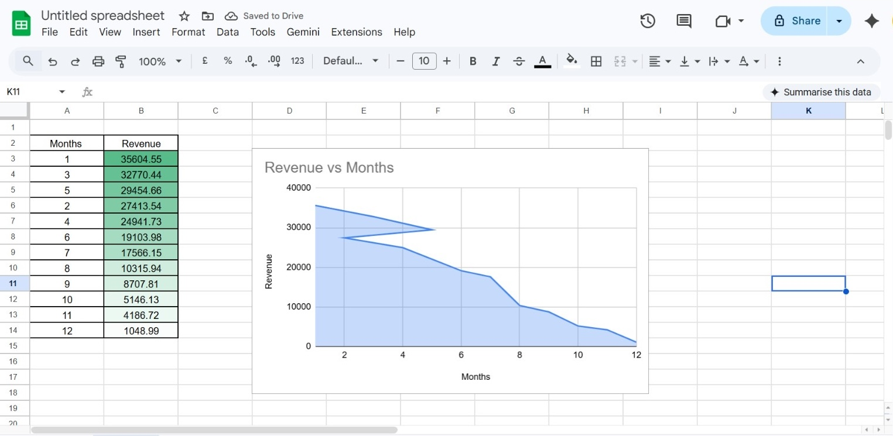
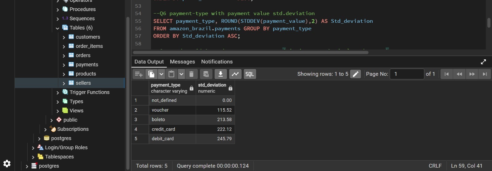
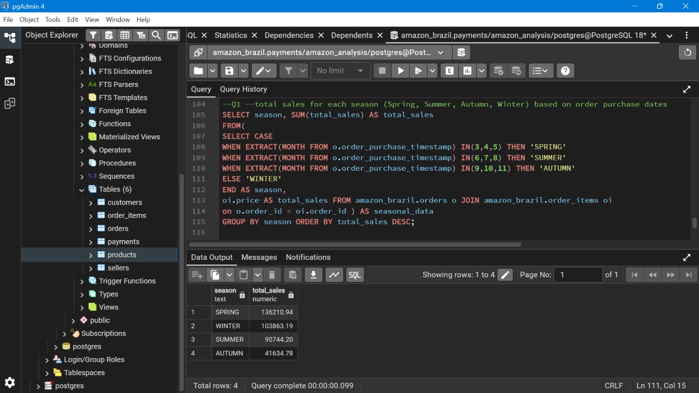
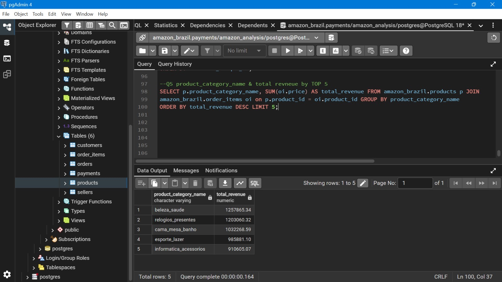
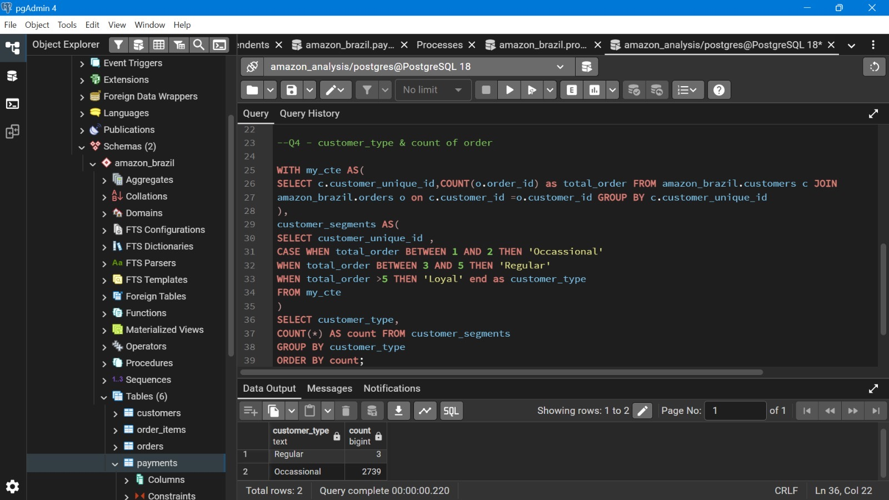
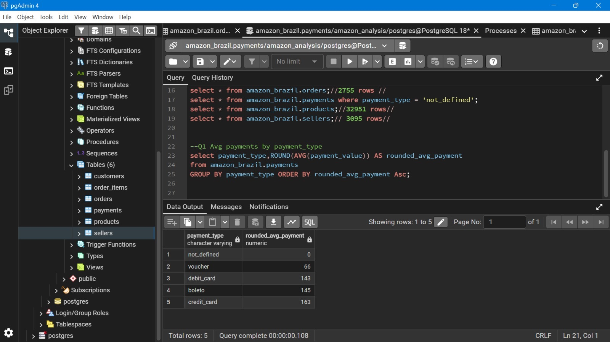

# Amazon Brazil SQL Analysis

## 📌 Project Overview

This project focuses on performing end-to-end SQL analysis on the Amazon Brazil E-commerce dataset using PostgreSQL and pgAdmin.

The objective of this project is to analyze customer behavior, payment patterns, sales trends, product performance, and customer segmentation using advanced SQL concepts such as:

* JOINS
* CTEs
* Window Functions
* Aggregate Functions
* CASE Statements
* Subqueries
* Data Cleaning Techniques

---

## 🛠️ Tools & Technologies Used

* PostgreSQL
* pgAdmin 4
* SQL
* Google Sheets (for visualization)
* GitHub

---

## 📂 Dataset Information

The dataset contains Amazon Brazil e-commerce transactional data.

### Tables Used:

* customers
* orders
* order_items
* payments
* products
* sellers

Dataset Source: Olist Brazilian E-commerce Dataset

---

## 📊 Key Business Analysis Performed

### Payment Analysis

* Average payment value by payment type
* Payment type percentage distribution
* Payment value standard deviation

### Sales Analysis

* Monthly revenue analysis
* Seasonal sales trends
* Top revenue generating product categories

### Customer Analysis

* Customer segmentation
* Returning customers identification
* Customer ranking based on average order value

### Product Analysis

* Product category price comparison
* High selling products
* Missing product category identification

---

## 📷 Project Screenshots

### Revenue Trend Analysis

Shows monthly revenue trends and peak sales months.



---

### Payment Type Distribution

Analysis of most preferred payment methods by customers.



---

### Seasonal Sales Analysis

Comparison of sales performance across seasons.



---

### Top Product Categories by Revenue

Highest revenue generating product categories.



---

### Customer Segmentation

Customers categorized as Occasional, Regular, and Loyal buyers.



---

### Average Payment Analysis

Average payment value across different payment types.



---

## 📈 Key Insights

* Credit Card is the most preferred payment method among customers.
* Spring season generated the highest overall sales.
* Beauty & Health category generated the maximum revenue.
* Most customers fall under the Occasional buyer segment.
* Certain product categories have very high pricing variations.

---

## 🚀 SQL Concepts Used

* INNER JOIN
* GROUP BY
* ORDER BY
* HAVING
* CASE WHEN
* Common Table Expressions (CTEs)
* Window Functions
* Aggregate Functions
* Subqueries
* Data Cleaning

---

## 📁 Project Structure

```bash
amazon-brazil-sql-analysis/
│
├── datasets/
├── queries/
├── screenshots/
├── Amazon_Brazil_analysis.pdf
└── README.md
```

---

## 👩‍💻 Author

Harshita Sharma
Aspiring Data Analyst | SQL | PostgreSQL | Python | Tableau

LinkedIn: https://www.linkedin.com/in/harshitasharma14/
